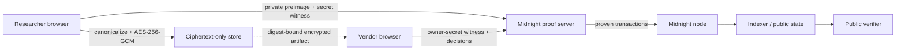

# VulnSeal

> **Seal the vulnerability. Prove the process. Reveal only when safe.**

VulnSeal is a privacy-preserving coordinated vulnerability disclosure workflow: a researcher can timestamp an encrypted report, a vendor can triage and remediate it, and anyone can verify the resulting resolution trail without learning the exploit or the researcher's real identity.

This is an experimental Buildathon project, not a production bounty platform. It does not prove that a vulnerability is valid, prevent semantic duplicates, escrow funds, or make a payout. It proves narrower workflow and knowledge claims described below.


## Why Midnight is essential

A normal encrypted database can hide a report, but its operator remains the authority for who submitted first, whether a decision was changed, and whether remediation and retesting occurred. VulnSeal uses Midnight's public/private execution model to prove knowledge of report-bound private inputs and enforce authorized transitions while publishing only commitments, coarse status, and receipts.

| Private / off-chain | Public Midnight ledger |
| --- | --- |
| Report title, summary, reproduction steps, impact, contacts, salt, actor secrets, encryption key, private retest evidence | Program policy digests, report and ciphertext commitments, derived pseudonymous researcher key, coarse status, patch/retest commitments, disclosed retest result, payout-authorization receipt, sequence |

Reports are canonicalized and encrypted in the browser with Web Crypto AES-256-GCM before the ciphertext-only store sees them. Midnight proves the report-bound workflow; AES-GCM protects the off-chain artifact. These are separate guarantees.

## Working evidence

VulnSeal is deployed on Midnight Preprod at [`83c5aa34…a9eb`](https://preprod.midnightexplorer.com/contracts/0x83c5aa340bd149b447c873fc2eecc4a9dadd183e5b26f9c3784e4c9acdaba9eb). On 2026-09-02, the contract finalized the complete synthetic workflow—deployment, sealed submission, triage, acceptance, patch, passing retest, and payout authorization—across seven `SUCCESS` transactions. The official indexer and RPC independently confirmed the final `PAYOUT_AUTHORIZED` action at block `2371914`; see [Preprod evidence](docs/preprod-evidence.md).

The repository also includes a reproducible local lifecycle against Midnight node `1.0.0`, indexer `4.3.3`, and proof server `8.1.0`. Its seven transaction identifiers and block heights are in [local-lifecycle.json](docs/evidence/local-lifecycle.json). Local and Preprod evidence are labeled separately.

The contract has eight proving circuits, meaningful private witnesses, generated ZKIR, and locally generated prover/verifier keys. The simulator suite has 13 lifecycle and adversarial tests. The UI journey has component, accessibility, failure-state, desktop, and mobile end-to-end tests. Exact results are recorded in [validation-report.md](docs/validation-report.md).


## Architecture



The monorepo is intentionally small:

- `contract/` — primary Compact contract, security-critical witnesses, generated artifacts, simulator tests.
- `api/` — typed deploy/join/call APIs and current Midnight.js provider wiring.
- `packages/shared/` — canonical report schema, encoding, AES-GCM, digests, redaction, environment validation.
- `cipherstore/` — immutable content-addressed ciphertext-only HTTP service.
- `integration/` — deterministic local wallet and full real-transaction lifecycle.
- `web/` — React/Vite role-based researcher, vendor, and verifier experience.
- `docs/` — architecture, privacy, threat model, ADRs, evidence, pitch, roadmap, and rubric mapping.

See [architecture.md](docs/architecture.md) and [privacy-model.md](docs/privacy-model.md) for the exact trust boundaries.

The ciphertext service enforces configurable aggregate storage and concurrent-upload limits. Its [operator guide](docs/cipherstore-operations.md) covers capacity errors, restart behavior and the requirement to use one writer process per data directory.

Ciphertext uploads/downloads have a 20-second client deadline. A stalled request returns recovery guidance instead of leaving the UI waiting indefinitely. Upload timeout does not prove the server discarded the ciphertext; keep the draft and backups. The client does not retry automatically.

The client also enforces the 5 MiB ciphertext limit independently of the server. Downloads are read incrementally and rejected when oversized, invalid UTF-8 or inconsistent with their digest. Where the workspace already holds a valid local encrypted copy, vendor review can fall back to that copy.

Startup now shows a loading screen before the Midnight components finish downloading. A component load/render failure shows recovery guidance and an explicit reload button. Avoid clearing site data when troubleshooting: it may contain your encrypted role copies. Only previously saved data is recoverable; unsaved edits can be lost after an application failure. Basic HTML instructions remain available when JavaScript cannot start.

## Prerequisites

- Node.js `>=24.11.1` (validated with `24.14.1`)
- npm `>=11`
- Docker with Compose and at least 8 GB available memory
- WSL2 on Windows for the Compact CLI
- Compact compiler `0.31.1`, language `0.23.0`
- Git LFS for normal repository hygiene

Versions are pinned from the current official `midnightntwrk/example-bboard` and `example-zkloan` references. See [research-baseline.md](docs/research-baseline.md) for the source commits and compatibility matrix.

## Quick start: product UI

```bash
npm ci
cp .env.example .env
npm run compact:skip-zk
npm run build
npm run demo
```

Open `http://127.0.0.1:5173`. Guided Local mode performs real canonicalization, SHA-256 commitment preparation, AES-GCM encryption, and ciphertext storage, while clearly labeling workflow transitions as a guided product demonstration. For actual Midnight transactions, connect a compatible Lace wallet, create a network program, and then submit a new report. Connecting a wallet does not convert a guided report into a network report.

## Compile the Compact contract

```bash
# Full compile: managed TypeScript, ZKIR, and keys
npm run compact

# Fast syntax/binding compile used by ordinary unit tests
npm run compact:skip-zk
```

`compact:skip-zk` recreates the managed output without proving keys. Run the full `npm run compact` again before a wallet-backed deployment or transaction.

On older x86 CPUs, the compiler-bundled ZKIR key generator may exit with illegal-instruction status. The contract itself still compiles. A reproducible compatibility route is documented in [ADR-0004](docs/adr/0004-legacy-cpu-toolchain.md): build the official ledger `ledger-8.0.2` ZKIR binary with Rust `1.96.0`, then set `VULNSEAL_ZKIR_BINARY` before `npm run compact`. The successful local run generated all eight real key pairs; no mock keys were used.

## Run tests and builds

For independent client implementations, the [single-role transaction API](docs/role-session-api.md) provides fixed researcher/vendor sessions with current-ledger checks and serialized private witnesses. The dedicated [role workspace](docs/role-workspace.md) uses this API; the combined demo remains separate.

The role workspace supports password-encrypted browser autosave for identity, prepared/received reports, the current incomplete report draft and working notes for each report, with fresh-tab unlock and revision checks against conflicting tab writes. Real role submissions require autosave so the transaction identifier can be persisted before calling the wallet; the [submission journal](docs/adr/0012-submission-journal.md) records attempts without claiming success or finality. Keep a downloaded backup too: clearing browser data removes local copies. Receiving keys and complete transaction history are outside this autosave. Working notes and tier selections are editable private copies, not proof of previous contract decisions. Draft and note edits are saved after a short pause in typing; wait for the saved confirmation. Select **Restore backups without connecting Lace** to read saved private reports and recover drafts/notes from files or browser copies when the wallet is unavailable. Offline recovery does not establish current contract authority; connect and verify the program before transactions. See [the storage design](docs/adr/0011-encrypted-browser-autosave.md).

Open **Device storage and retention** to inspect the browser's site-wide usage/quota estimates and last reported retention status. **Request persistent storage** asks only when clicked; the browser may refuse or omit this capability. A grant does not protect against clearing site data or losing the device. Quota failures stop autosave with instructions to export an encrypted backup before removing unneeded copies. Estimates do not reserve capacity for the next save.

Use **Lock and switch workspace** after the current role has been saved to return to the encrypted-copy picker in the same tab. Each unlock requires the selected copy's password; one role/program is active at a time. Locking stops that workspace's autosave and removes its private view. If receiving keys are loaded, first confirm retention of their separate encrypted backup. Locking does not disconnect Lace, revoke authority, close other tabs or guarantee forensic memory erasure.

The role workspace requests a browser leave warning while its identity/reports/draft/notes are unsaved, an operation is running, or receiving keys are loaded. Receiving keys keep the warning active even after a separate key export because the workspace cannot confirm that file was retained. This warning is best effort: browsers can suppress it, and crashes or mobile app termination may bypass it. The warning itself does not save data; wait for draft/note persistence and retain the separate encrypted receiving-key backup before leaving.

```bash
npm run validate
npm run test:e2e
npm run audit:prod
```

`validate` first builds shared, contract and API packages before their consumers, then runs all typechecks and tests against those current artifacts. Compile the Compact bindings first on a new checkout. Individual workspace checks rely on these built package exports; use the root validation command after cross-package changes to avoid stale `dist` imports.

The Playwright configuration builds and serves the production UI with installed Chrome, then exercises the complete guided journey, rejection/closure, failed-retest recovery, custom program policies, and encrypted backup/restore after closing a tab at desktop and Pixel 7 viewports. Browser concurrency is bounded to four workers locally and two in CI because each loads ledger WASM and performs backup/key cryptography. CI installs Chrome and runs these same journeys. Optional visual captures:

```powershell
$env:VULNSEAL_CAPTURE_VISUALS='1'; npm run test:e2e
```

## Reproduce the real local Midnight lifecycle

Start the pinned local stack:

```bash
docker compose -f infra/standalone.yml up -d
```

If the official amd64 images cannot run on an older host CPU, first install Docker's ARM64 emulator and use the recorded official manifests:

```bash
docker run --privileged --rm tonistiigi/binfmt --install arm64
docker compose --env-file infra/arm64-emulation.env -f infra/standalone.yml up -d
```

After `contract/src/managed/vulnseal/keys` exists, provide a local-only encryption password without committing it:

```powershell
$env:MIDNIGHT_STORAGE_PASSWORD='choose-a-local-password'
npm run test:integration
```

The runner waits for the deterministic dev wallet, deploys a new contract, submits and accepts a sealed report, anchors a patch, submits a passing retest, authorizes payout, checks public-state privacy, and writes redacted evidence to `docs/evidence/local-lifecycle.json` only after success.

Stop the services when finished:

```bash
docker compose -f infra/standalone.yml down
```

## Reproduce the Preprod deployment ceremony

The headless ceremony keeps the generated test-wallet seed and private-state password in the Git-ignored `integration/.env.preprod`; neither value is printed. It outputs only the public funding address:

```bash
npm run preprod:prepare
docker run --privileged --rm tonistiigi/binfmt --install arm64
npm run midnight:proof:up
```

Fund that public address using the official human-facing [Preprod faucet](https://midnight-tmnight-preprod.nethermind.dev/), then run:

```bash
npm run preprod:lifecycle
npm run preprod:verify
```

The lifecycle runner synchronizes the wallet, persists only an AES-256-GCM-encrypted checkpoint ([ADR-0005](docs/adr/0005-encrypted-wallet-checkpoint.md)), registers received tNIGHT for DUST generation when required, deploys VulnSeal, executes all seven lifecycle transactions, verifies the final public state and privacy allowlist, and writes `docs/evidence/preprod-lifecycle.json` only after success. `preprod:verify` needs no wallet or secrets; it rechecks all recorded identifiers, hashes, contract tip, and finality through the public official indexer/RPC. The reference run and snapshot are recorded in [preprod-evidence.md](docs/preprod-evidence.md). Stop the local proof server with `npm run midnight:proof:down`.

## Three-minute walkthrough

1. Open **Programs** and inspect the public scope, response, reward, and disclosure policy.
2. Switch to **Researcher**, enter the report locally, and seal it. Observe canonicalization, encryption, ciphertext digest, and commitment stages.
3. Save the submission receipt; the plaintext never enters public state.
4. Switch to **Vendor**, triage and accept the report, then anchor a patch commitment.
5. Return as **Researcher**, bind private retest evidence to that report and patch and disclose only pass/fail.
6. As **Vendor**, authorize the configured reward tier.
7. Open **Public verifier** to show the session's commitment-to-resolution trail without the exploit.

The report editor accepts attachment metadata by hashing a local file (up to 32 MiB) or entering its filename, media type, byte size and SHA-256. Added entries are included in the encrypted report and private recovery backup. File contents are never uploaded or included in those backups; retain originals and exchange them through your agreed secure channel. The vendor view can check a received file against the sealed digest and size. Larger files require an externally computed digest. Complete or clear manual attachment fields before sealing; only added entries survive recovery.

For an independent current-state check, open **Independent verifier**, select the network, enter a contract address and optionally a report commitment, then choose **Load public state**. No wallet is required. Network report sessions expose **Download public receipt**; another browser can import that public JSON file and query the ledger. After selecting and verifying a report, copy its public verification link to share the same lookup. Private recovery files are separate and must not be shared.

The lookup checks the indexer's successful contract action against RPC finality and block hash, plus an optional expected ciphertext digest. It trusts those data sources and does not authenticate deployed circuit code, reconstruct history, prove exploit validity or prove payment. Preprod endpoints are built in; local lookup uses `VITE_INDEXER_HTTP_URL` and `VITE_RPC_URL` when the app is configured locally. See [ADR-0007](docs/adr/0007-independent-public-lookup.md).

The production-ready narration is in [demo-script.md](docs/demo-script.md).

For separate participants, open **Open role workspace** (`/#roles`) in distinct browser profiles. Vendor setup, public invitations, researcher join, one-role encrypted backup, multiple prepared reports, ledger-bound disclosure import and role-specific transactions are described in the [role workspace guide](docs/role-workspace.md). Its native Lace transaction ceremony still requires live verification.

## Security and honest limitations

- Authorization proves knowledge of a program- or report-bound secret; loss or theft of that secret compromises the corresponding role.
- A derived pseudonymous researcher key can be linkable within the subject construction. It is not proof of a civil identity.
- The contract proves commitment consistency and workflow predicates, not technical validity, objective severity, vendor honesty, or semantic uniqueness.
- The ciphertext service can delete or withhold blobs. It cannot silently change one without breaking its digest, and it never needs plaintext.
- Browser compromise can expose plaintext, encryption material, and witnesses before proving.
- `PAYOUT_AUTHORIZED` is an auditable authorization receipt only; no asset is escrowed or transferred in Wave 1.
- Preprod can reset and is not mainnet; the recorded deployment is test-network evidence, not a production-security or permanence guarantee.

Read [SECURITY.md](SECURITY.md), [threat-model.md](docs/threat-model.md), and [claims-evidence.md](docs/claims-evidence.md) before treating VulnSeal as more than experimental software.

The current completion audit and remaining end-to-end work are tracked in [readiness-audit.md](docs/readiness-audit.md). Browser role secrets are randomly generated per tab. Before closing it, open **Private recovery**, choose and confirm a password of at least 12 characters, and download the encrypted backup. Restore the file and password in a fresh tab; network recovery also connects Lace and checks the current ledger. Save a new backup after new reports or private evidence. The file controls **both experimental roles** and must not be shared as a vendor handoff. A dedicated [role workspace](docs/role-workspace.md) now holds one actor authority; native Lace multi-profile transaction validation remains outstanding. See [ADR-0006](docs/adr/0006-encrypted-browser-recovery.md) for the format, checks, and limits.

Use **Private exchange** for confidential report delivery. The recipient creates a receiving key, saves its encrypted backup, and shares only the public receiving-key file. The researcher imports that public file, verifies its fingerprint through an agreed channel, and downloads a recipient-encrypted disclosure from a sealed report. The recipient can restore its receiving-key backup in another browser and open the disclosure without a wallet or actor secrets. Exchange the downloaded files through your agreed channel; the app does not send them. Receiving keys do not authorize contract transitions, and decryption alone does not prove on-chain submission. See [ADR-0008](docs/adr/0008-recipient-bound-disclosure.md).

## Wave status

- **Wave 1 — Proof of Disclosure:** implemented and deployed to Preprod; Compact compile, simulator tests, real local and Preprod transactions/proofs, encryption pipeline, full UX, and competition artifacts are present.
- **Wave 2 — Proof of Resolution:** test-token escrow, disputes/mediators, encrypted update chain, and Preprod hardening. See [wave-2-plan.md](docs/wave-2-plan.md).
- **Wave 3 — Proof of Adoption:** GitHub integration, production ciphertext adapter, privacy-safe analytics, pilots, and SDK. See [wave-3-plan.md](docs/wave-3-plan.md).

## Buildathon attribution

Built for AKINDO **Build Privacy-First Apps on Midnight** and directly aligned with Midnight's Request for Startups theme, **Provable Bug Bounty Board**. Provider, wallet, and Compose patterns were adapted from official Midnight examples at the exact commits recorded in [NOTICE](NOTICE). No archived `example-counter` foundation is used.

Before public submission, a maintainer must publish the repository and add the required GitHub topic `midnightntwrk` plus the recommended topics listed in [wave-1-progress.md](docs/wave-1-progress.md). This repository is not pushed or published by the build scripts.

## License

Copyright 2026 VulnSeal contributors. Licensed under the [Apache License 2.0](LICENSE).
