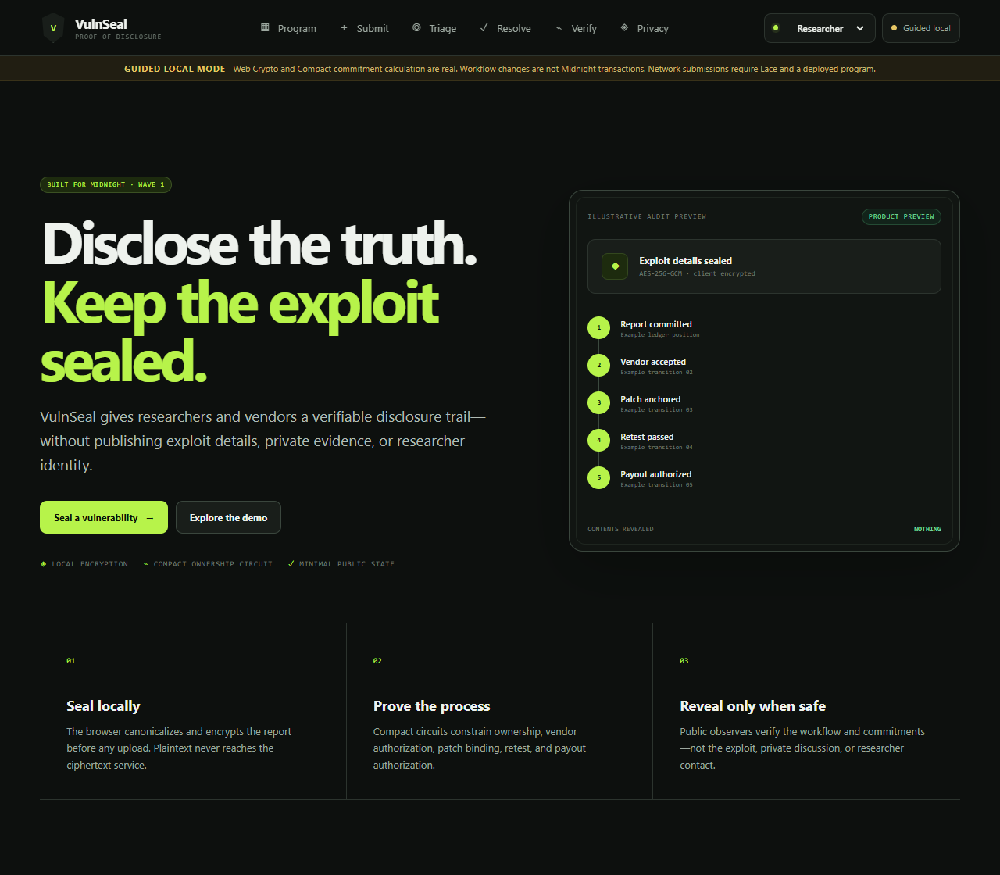
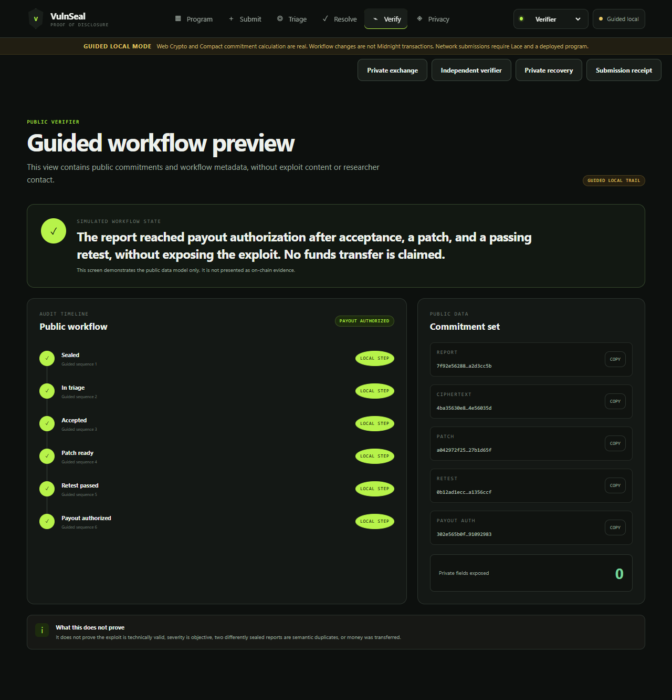
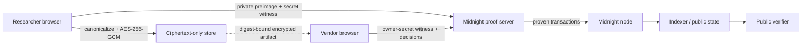

# VulnSeal

> **Seal the vulnerability. Prove the process. Reveal only when safe.**

VulnSeal is a privacy-preserving coordinated vulnerability disclosure workflow: a researcher can timestamp an encrypted report, a vendor can triage and remediate it, and anyone can verify the resulting resolution trail without learning the exploit or the researcher's real identity.

This is an experimental Buildathon project, not a production bounty platform. It does not prove that a vulnerability is valid, prevent semantic duplicates, escrow funds, or make a payout. It proves narrower workflow and knowledge claims described below.



## Why Midnight is essential

A normal encrypted database can hide a report, but its operator remains the authority for who submitted first, whether a decision was changed, and whether remediation and retesting occurred. VulnSeal uses Midnight's public/private execution model to prove knowledge of report-bound private inputs and enforce authorized transitions while publishing only commitments, coarse status, and receipts.

| Private / off-chain | Public Midnight ledger |
| --- | --- |
| Report title, summary, reproduction steps, impact, contacts, salt, actor secrets, encryption key, private retest evidence | Program policy digests, report and ciphertext commitments, derived pseudonymous researcher key, coarse status, patch/retest commitments, disclosed retest result, payout-authorization receipt, sequence |

Reports are canonicalized and encrypted in the browser with Web Crypto AES-256-GCM before the ciphertext-only store sees them. Midnight proves the report-bound workflow; AES-GCM protects the off-chain artifact. These are separate guarantees.

## Working evidence

The repository includes a reproducible local lifecycle that deployed the Compact contract and finalized seven real transactions against Midnight node `1.0.0`, indexer `4.3.3`, and proof server `8.1.0`. The run reached `PAYOUT_AUTHORIZED`; transaction IDs and block heights are in [local-lifecycle.json](docs/evidence/local-lifecycle.json). This is local ephemeral-chain evidence, **not Preprod evidence**.

The contract has eight proving circuits, meaningful private witnesses, generated ZKIR, and locally generated prover/verifier keys. The simulator suite has 13 lifecycle and adversarial tests. The UI journey has component, accessibility, failure-state, desktop, and mobile end-to-end tests. Exact results are recorded in [validation-report.md](docs/validation-report.md).



## Architecture



The monorepo is intentionally small:

- `contract/` — primary Compact contract, security-critical witnesses, generated artifacts, simulator tests.
- `api/` — typed deploy/join/call APIs and current Midnight.js provider wiring.
- `packages/shared/` — canonical report schema, encoding, AES-GCM, digests, redaction, environment validation.
- `cipherstore/` — immutable content-addressed ciphertext-only HTTP service.
- `integration/` — deterministic local wallet and full real-transaction lifecycle.
- `web/` — React/Vite role-based researcher, vendor, and verifier experience.
- `docs/` — architecture, privacy, threat model, ADRs, evidence, pitch, roadmap, and rubric mapping.

See [architecture.md](docs/architecture.md) and [privacy-model.md](docs/privacy-model.md) for the exact trust boundaries.

## Prerequisites

- Node.js `>=24.11.1` (validated with `24.14.1`)
- npm `>=11`
- Docker with Compose and at least 8 GB available memory
- WSL2 on Windows for the Compact CLI
- Compact compiler `0.31.1`, language `0.23.0`
- Git LFS for normal repository hygiene

Versions are pinned from the current official `midnightntwrk/example-bboard` and `example-zkloan` references. See [research-baseline.md](docs/research-baseline.md) for the source commits and compatibility matrix.

## Quick start: product UI

```bash
npm ci
cp .env.example .env
npm run compact:skip-zk
npm run demo
```

Open `http://127.0.0.1:5173`. Guided Local mode performs real canonicalization, SHA-256 commitment preparation, AES-GCM encryption, and ciphertext storage, while clearly labeling workflow transitions as a guided product demonstration. Connect a compatible Lace wallet to submit actual Midnight transactions from the browser.

## Compile the Compact contract

```bash
# Full compile: managed TypeScript, ZKIR, and keys
npm run compact

# Fast syntax/binding compile used by ordinary unit tests
npm run compact:skip-zk
```

On older x86 CPUs, the compiler-bundled ZKIR key generator may exit with illegal-instruction status. The contract itself still compiles. A reproducible compatibility route is documented in [ADR-0004](docs/adr/0004-legacy-cpu-toolchain.md): build the official ledger `ledger-8.0.2` ZKIR binary with Rust `1.96.0`, then set `VULNSEAL_ZKIR_BINARY` before `npm run compact`. The successful local run generated all eight real key pairs; no mock keys were used.

## Run tests and builds

```bash
npm run typecheck
npm run test:run
npm run build
npm run test:e2e
npm run audit:prod
```

The Playwright configuration uses installed Chrome and exercises the complete guided journey at desktop and Pixel 7 viewports. Optional visual captures:

```powershell
$env:VULNSEAL_CAPTURE_VISUALS='1'; npm run test:e2e
```

## Reproduce the real local Midnight lifecycle

Start the pinned local stack:

```bash
docker compose -f infra/standalone.yml up -d
```

If the official amd64 images cannot run on an older host CPU, first install Docker's ARM64 emulator and use the recorded official manifests:

```bash
docker run --privileged --rm tonistiigi/binfmt --install arm64
docker compose --env-file infra/arm64-emulation.env -f infra/standalone.yml up -d
```

After `contract/src/managed/vulnseal/keys` exists, provide a local-only encryption password without committing it:

```powershell
$env:MIDNIGHT_STORAGE_PASSWORD='choose-a-local-password'
npm run test:integration
```

The runner waits for the deterministic dev wallet, deploys a new contract, submits and accepts a sealed report, anchors a patch, submits a passing retest, authorizes payout, checks public-state privacy, and writes redacted evidence to `docs/evidence/local-lifecycle.json` only after success.

Stop the services when finished:

```bash
docker compose -f infra/standalone.yml down
```

## Three-minute walkthrough

1. Open **Programs** and inspect the public scope, response, reward, and disclosure policy.
2. Switch to **Researcher**, enter the report locally, and seal it. Observe canonicalization, encryption, ciphertext digest, and commitment stages.
3. Save the submission receipt; the plaintext never enters public state.
4. Switch to **Vendor**, triage and accept the report, then anchor a patch commitment.
5. Return as **Researcher**, bind private retest evidence to that report and patch and disclose only pass/fail.
6. As **Vendor**, authorize the configured reward tier.
7. Open **Public verifier** to show the commitment-to-resolution trail without the exploit.

The production-ready narration is in [demo-script.md](docs/demo-script.md).

## Security and honest limitations

- Authorization proves knowledge of a program- or report-bound secret; loss or theft of that secret compromises the corresponding role.
- A derived pseudonymous researcher key can be linkable within the subject construction. It is not proof of a civil identity.
- The contract proves commitment consistency and workflow predicates, not technical validity, objective severity, vendor honesty, or semantic uniqueness.
- The ciphertext service can delete or withhold blobs. It cannot silently change one without breaking its digest, and it never needs plaintext.
- Browser compromise can expose plaintext, encryption material, and witnesses before proving.
- `PAYOUT_AUTHORIZED` is an auditable authorization receipt only; no asset is escrowed or transferred in Wave 1.
- The evidence in this repository is local. [preprod-evidence.md](docs/preprod-evidence.md) contains no fabricated address or transaction.

Read [SECURITY.md](SECURITY.md), [threat-model.md](docs/threat-model.md), and [claims-evidence.md](docs/claims-evidence.md) before treating VulnSeal as more than experimental software.

## Wave status

- **Wave 1 — Proof of Disclosure:** implemented locally; Compact compile, simulator tests, real local transactions/proofs, encryption pipeline, full UX, and competition artifacts are present. Preprod deployment remains a human-signing step.
- **Wave 2 — Proof of Resolution:** test-token escrow, disputes/mediators, encrypted update chain, and Preprod hardening. See [wave-2-plan.md](docs/wave-2-plan.md).
- **Wave 3 — Proof of Adoption:** GitHub integration, production ciphertext adapter, privacy-safe analytics, pilots, and SDK. See [wave-3-plan.md](docs/wave-3-plan.md).

## Buildathon attribution

Built for AKINDO **Build Privacy-First Apps on Midnight** and directly aligned with Midnight's Request for Startups theme, **Provable Bug Bounty Board**. Provider, wallet, and Compose patterns were adapted from official Midnight examples at the exact commits recorded in [NOTICE](NOTICE). No archived `example-counter` foundation is used.

Before public submission, a maintainer must publish the repository and add the required GitHub topic `midnightntwrk` plus the recommended topics listed in [wave-1-progress.md](docs/wave-1-progress.md). This repository is not pushed or published by the build scripts.

## License

Copyright 2026 VulnSeal contributors. Licensed under the [Apache License 2.0](LICENSE).
