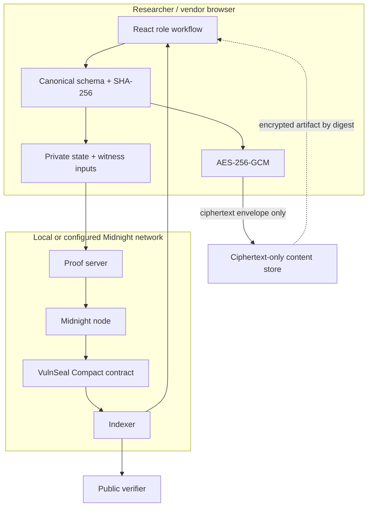
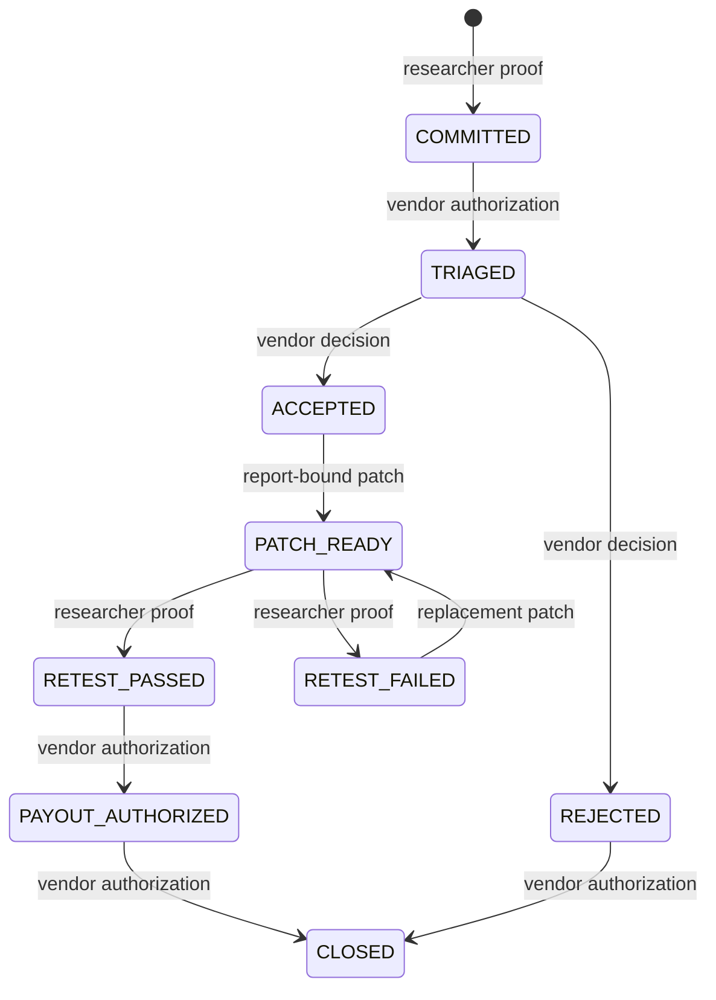

# Architecture

## System boundaries

The browser is the plaintext boundary. The ciphertext store is untrusted for availability and receives no decryption material. The proof server necessarily processes proof preimages in the selected local architecture and must therefore be treated as sensitive infrastructure; production hardening should use the network-supported secure proof path and deployment guidance current at that time.

## Domain state

### Program public state

| Field | Visibility | Purpose |
| --- | --- | --- |
| `programId` | Public | Stable program subject |
| `ownerKey` | Public derived key | Binds vendor secret to program |
| `scopeDigest` | Public | Commits to published scope |
| `responsePolicyDigest`, `responseDays` | Public | Response promise |
| `rewardPolicyDigest` | Public | Reward policy commitment |
| `disclosurePolicyDigest`, `disclosureDelayDays` | Public | Optional coordinated-disclosure policy |
| `sequence` | Public | Contract-local ordering |

### Report public state

| Field | Visibility | Meaning |
| --- | --- | --- |
| `commitment` | Public | `H(domain, canonicalDigest, salt, programId)` |
| `ciphertextDigest` | Public | Integrity/address binding for encrypted artifact |
| `researcherKey` | Public pseudonym | `H(domain, programId, commitment, researcherSecret)` |
| `submissionReceipt` | Public | Binds commitment, ciphertext digest, and pseudonym |
| `status` | Public | Coarse workflow status only |
| `severity`, `decisionDigest` | Public | Intentionally disclosed triage result/policy evidence |
| `patchCommitment` | Public | Patch digest bound to report |
| `retestCommitment`, `retestPassed` | Public | Private evidence binding plus intentionally disclosed result |
| `payoutReceipt`, `rewardTier` | Public | Authorization receipt and tier; no transfer |
| `createdSequence`, `updatedSequence` | Public | Contract-local ordering |

### Private and off-chain data

Canonical report fields, report salt, actor secrets, AES key, report preimage, patch evidence preimage, and retest evidence digest remain in browser/private state. Encrypted envelopes are off-chain and content-addressed.

## State machine

No general status setter exists. Every edge is a separate circuit with edge-specific assertions.

## Contract invariants

- `submitReport` rejects an existing commitment, so a record cannot be overwritten silently.
- Constructor owner authority is derived from the private secret supplied at deployment and the public program subject.
- Vendor transitions recompute the owner key from a private witness; researcher transitions recompute both the report commitment and report-bound researcher key.
- Patch witness data must name the target report.
- Retest witness data must name both the target report and current patch commitment.
- Payout requires `RETEST_PASSED` and a true public result; receipts are also stored in a set to prevent reuse.
- Domain separators distinguish vendor, report, researcher, submission, patch, retest, and payout constructions.
- No report plaintext field exists in the public `ReportRecord` type.

## Runtime packages

`api/` constructs the current Midnight.js provider set: encrypted LevelDB private state, indexer public data, filesystem or browser-fetched ZK configuration, HTTP proof provider, wallet provider, and Midnight submit provider. A direct root pin of on-chain runtime v3 `3.0.0` is intentional: without a single module instance, JavaScript class-identity checks reject a valid generated `StateValue` when Midnight.js merges call data.

The browser package imports API subpaths so the Node LevelDB provider is not bundled into the UI.

## Ciphertext flow

1. Validate and canonicalize a versioned report schema with lexicographically sorted object keys.
2. Hash the canonical UTF-8 bytes with SHA-256.
3. Generate a 256-bit AES key and 96-bit random IV.
4. Encrypt with AES-GCM and program-bound additional authenticated data.
5. Encode an explicit versioned envelope.
6. Hash the envelope and store it immutably at that digest.
7. Pass only the digest plus Compact commitment inputs into the network workflow.

Corruption or a wrong key/AAD causes authenticated decryption to fail. The content store recomputes the requested digest and rejects mismatches.

## Evidence modes

- **Simulator:** real Compact-generated JavaScript execution with deterministic witnesses; no network proof or transaction claim.
- **Guided Local UI:** real browser cryptography and storage with a clearly labeled product journey; transitions are not called finalized unless a wallet/network provider returns evidence.
- **Local Midnight integration:** real proofs, node transactions, indexer reads, transaction IDs, and block heights on an ephemeral undeployed network.
- **Preprod:** not yet performed; no address is claimed.
